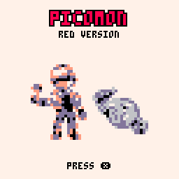
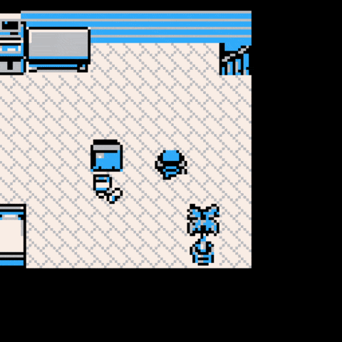
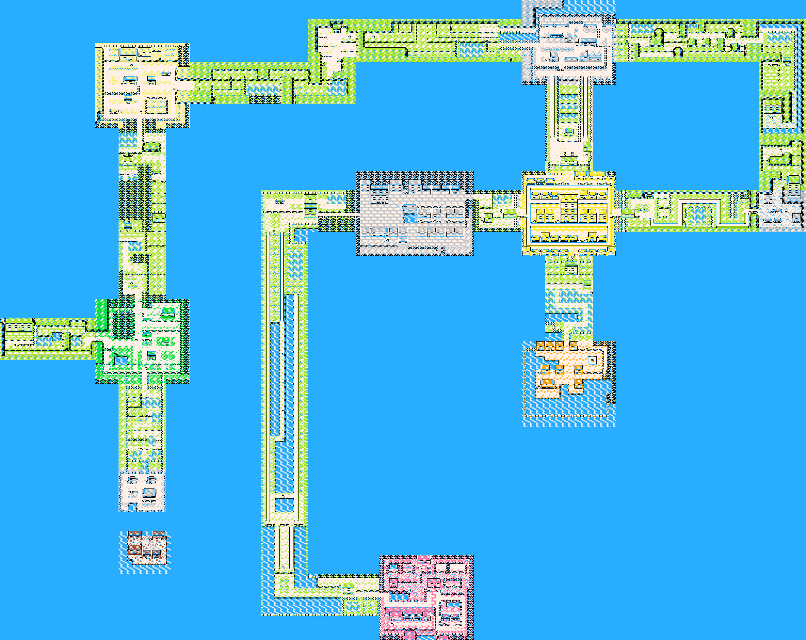

> **AI Disclaimer:** Coding agents were used extensively in this project.

# Picomon Red

 

PICO-8 demake of Pokémon Red. This repo is an experiment in "How much game can fit into a PICO-8 32KB cart?" (as it turns out, a lot)



This demake has:
- 41 pokemon (34 catchable)
- Updated movesets (heavily inspired by Red++)
- Trainers
- 3 music tracks
- All cities and most routes
- 8 gym leaders
- The elite 4 + champion

It cuts:
- Most building indoors
- All caves
- TMs and HMs
- Findable items and shops (items are infinite)
- The PC system (you may only have 6 pokemon)

The repo holds no official assets, maps or music: `build.sh` extracts them from a legally obtained Pokémon Red ROM and builds the `.p8` cart file. All artwork is downscaled.

## Build and play

```
./build.sh "Pokemon - Red Version (USA, Europe).gb"
```

Then open `cart/pokered.p8.png` in PICO-8 (`pico8 -run cart/pokered.p8.png`).

- A legally obtained Pokémon Red (USA, Europe) rom, SHA-1 `ea9bcae617fdf159b045185467ae58b2e4a48b9a`.
- [uv](https://docs.astral.sh/uv/), which installs the Python dependencies (Pillow, [shrinko8](https://github.com/thisismypassport/shrinko8)) on first run.

## World Map



_Fuchsia City and Pallet Town connect to Cinnabar Island by surfable pokemon. The surfable pokemon appear once you have Sabrina's badge._
